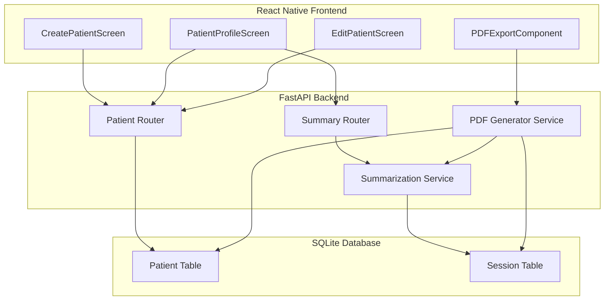

# Design Document: Enhanced Patient Report System

## Overview

This design document outlines the architecture and implementation approach for enhancing the Auralis psychotherapy application with comprehensive patient information collection, structured session and overall summary generation following the professional psychotherapy report template, and PDF export functionality for sharing reports with other healthcare providers.

The enhancement involves:
1. Extending the Patient database model with additional fields for medical, psychiatric, family, and social history
2. Creating a multi-section patient registration form in the frontend
3. Updating the summarization service to generate template-based session and overall summaries
4. Implementing PDF generation and export functionality

## Architecture



## Components and Interfaces

### 1. Extended Patient Model (Backend)

The Patient model will be extended with new fields organized into sections:

```python
class Patient(Base):
    # Existing fields
    id: int
    therapist_id: int
    patient_id: str
    full_name: str
    date_of_birth: datetime
    gender: str
    phone: str
    email: str
    
    # Patient Information (new)
    age: int
    residence: str
    education: str
    occupation: str
    marital_status: str
    date_of_assessment: datetime
    
    # Medical History (new)
    current_medical_conditions: str
    past_medical_conditions: str
    current_medications: str
    allergies: str
    hospitalizations: str
    
    # Psychiatric History (new)
    previous_psychiatric_diagnoses: str
    previous_psychiatric_treatment: str
    previous_psychiatric_hospitalizations: str
    suicide_self_harm_history: str
    substance_use_history: str
    
    # Family History (new)
    psychiatric_illness_family: str
    medical_illness_family: str
    family_dynamics: str
    significant_family_events: str
    
    # Social History (new)
    childhood_developmental_history: str
    educational_history: str
    occupational_history: str
    relationship_history: str
    social_support_system: str
    living_situation: str
    cultural_religious_background: str
    
    # Clinical Assessment (new - for overall summary)
    chief_complaint: str
    chief_complaint_description: str
    illness_onset: str
    illness_progression: str
    previous_episodes: str
    triggers: str
    impact_on_functioning: str
    
    # Baseline Assessment - Mental Status Examination (new)
    mse_appearance: str
    mse_behavior: str
    mse_speech: str
    mse_mood: str
    mse_affect: str
    mse_thought_process: str
    mse_thought_content: str
    mse_perception: str
    mse_cognition: str
    mse_insight: str
    mse_judgment: str
```

### 2. Patient API Endpoints

```python
# Existing endpoints (enhanced)
POST /api/patients - Create patient with all fields
GET /api/patients/{id} - Get patient with all fields
PUT /api/patients/{id} - Update patient fields

# New endpoints
GET /api/patients/{id}/overall-summary - Generate overall summary
GET /api/patients/{id}/export-pdf - Generate and download PDF report
```

### 3. Frontend Components

#### CreatePatientScreen (Enhanced)
- Multi-section form with collapsible sections
- Sections: Patient Information, Medical History, Psychiatric History, Family History, Social History
- Form validation for required fields
- Progress indicator showing completion

#### PatientProfileScreen (Enhanced)
- Display all patient information in organized sections
- Edit button to modify patient data
- Export PDF button
- Overall summary view

#### PDFExportComponent (New)
- Generate PDF using react-native-html-to-pdf or expo-print
- Format following psychotherapy report template
- Include patient info, overall summary, and session summaries

### 4. Summarization Service Updates

#### Session Summary Template
```
SESSION RECORDING FORM
Session #: {session_number} | Date: {session_date}
Topics Discussed: {topics}
Interventions Used: {interventions}
Client Progress: {progress}
Homework Assigned: {homework}
Therapist Observations: {observations}
Plan for Next Session: {next_plan}
Therapist Name: {therapist_name}
Date: {date}
```

#### Overall Summary Template
```
PSYCHOTHERAPY REPORT
Patient Information: {all patient info sections}
Chief Complaints: {complaint and description}
Course of Illness: {onset, progression, episodes, triggers, impact}
Baseline Assessment - Mental Status Examination: {all MSE fields}
Session Summaries: {chronological list of all sessions}
Report Generated: {current_date}
Therapist: {therapist_name}
```

## Data Models

### Patient TypeScript Interface (Frontend)

```typescript
interface Patient {
  // Existing
  id: number;
  patient_id: string;
  full_name: string;
  date_of_birth?: string;
  gender?: string;
  phone?: string;
  email?: string;
  
  // Patient Information
  age?: number;
  residence?: string;
  education?: string;
  occupation?: string;
  marital_status?: string;
  date_of_assessment?: string;
  
  // Medical History
  current_medical_conditions?: string;
  past_medical_conditions?: string;
  current_medications?: string;
  allergies?: string;
  hospitalizations?: string;
  
  // Psychiatric History
  previous_psychiatric_diagnoses?: string;
  previous_psychiatric_treatment?: string;
  previous_psychiatric_hospitalizations?: string;
  suicide_self_harm_history?: string;
  substance_use_history?: string;
  
  // Family History
  psychiatric_illness_family?: string;
  medical_illness_family?: string;
  family_dynamics?: string;
  significant_family_events?: string;
  
  // Social History
  childhood_developmental_history?: string;
  educational_history?: string;
  occupational_history?: string;
  relationship_history?: string;
  social_support_system?: string;
  living_situation?: string;
  cultural_religious_background?: string;
  
  // Clinical Assessment
  chief_complaint?: string;
  chief_complaint_description?: string;
  illness_onset?: string;
  illness_progression?: string;
  previous_episodes?: string;
  triggers?: string;
  impact_on_functioning?: string;
  
  // Mental Status Examination
  mse_appearance?: string;
  mse_behavior?: string;
  mse_speech?: string;
  mse_mood?: string;
  mse_affect?: string;
  mse_thought_process?: string;
  mse_thought_content?: string;
  mse_perception?: string;
  mse_cognition?: string;
  mse_insight?: string;
  mse_judgment?: string;
}

interface SessionSummary {
  session_number: number;
  session_date: string;
  topics_discussed: string;
  interventions_used: string;
  client_progress: string;
  homework_assigned: string;
  therapist_observations: string;
  plan_for_next_session: string;
}

interface OverallSummary {
  patient: Patient;
  chief_complaints: {
    primary: string;
    description: string;
  };
  course_of_illness: {
    onset: string;
    progression: string;
    previous_episodes: string;
    triggers: string;
    impact_on_functioning: string;
  };
  baseline_assessment: {
    appearance: string;
    behavior: string;
    speech: string;
    mood: string;
    affect: string;
    thought_process: string;
    thought_content: string;
    perception: string;
    cognition: string;
    insight: string;
    judgment: string;
  };
  session_summaries: SessionSummary[];
  generated_date: string;
  therapist_name: string;
}

interface PDFReport {
  patient_info: Patient;
  overall_summary: OverallSummary;
  session_summaries: SessionSummary[];
  generated_date: string;
  therapist_name: string;
}
```

## Correctness Properties

*A property is a characteristic or behavior that should hold true across all valid executions of a system-essentially, a formal statement about what the system should do. Properties serve as the bridge between human-readable specifications and machine-verifiable correctness guarantees.*

### Property 1: Patient Data Round-Trip Persistence
*For any* valid patient data object with all fields populated, submitting it to the create endpoint and then retrieving it should return an equivalent patient object with all fields preserved.
**Validates: Requirements 1.6**

### Property 2: Patient View Completeness
*For any* patient with complete data stored in the database, the patient profile view should contain all stored field values in the response.
**Validates: Requirements 1.7**

### Property 3: Session Summary Contains Required Metadata
*For any* session, the generated summary should contain the session number and the session date formatted correctly.
**Validates: Requirements 2.1**

### Property 4: Session Summary Structure Completeness
*For any* generated session summary, the output should contain all required sections: topics discussed, interventions used, client progress, homework assigned, and therapist observations.
**Validates: Requirements 2.2, 2.3**

### Property 5: Overall Summary Contains Patient Information
*For any* patient with complete data, the generated overall summary should contain all patient information sections (patient info, medical history, psychiatric history, family history, social history).
**Validates: Requirements 3.1**

### Property 6: Overall Summary Contains Clinical Sections
*For any* generated overall summary, it should contain chief complaints section and course of illness section with all required fields.
**Validates: Requirements 3.2, 3.3, 3.4**

### Property 7: Session Aggregation Ordering
*For any* patient with multiple sessions, the overall summary should contain findings from all sessions ordered chronologically by session date.
**Validates: Requirements 3.5**

### Property 8: PDF Contains All Patient Sections
*For any* patient, the exported PDF content should contain all patient information sections in the correct template order.
**Validates: Requirements 4.1, 4.4**

### Property 9: PDF Contains All Session Summaries
*For any* patient with sessions, the exported PDF should contain summaries for all sessions with their respective dates.
**Validates: Requirements 4.2, 4.3**

### Property 10: PDF Header Information
*For any* generated PDF, the document should contain the therapist name and the generation date in the header section.
**Validates: Requirements 4.5**

### Property 11: Edit Preserves Creation Timestamp
*For any* patient edit operation, the created_at timestamp should remain unchanged while the updated_at timestamp should be updated to reflect the modification time.
**Validates: Requirements 5.2, 5.3**

## Error Handling

### Backend Error Handling
- **Validation Errors**: Return 422 with detailed field-level error messages for invalid patient data
- **Not Found Errors**: Return 404 when patient or session is not found
- **PDF Generation Errors**: Return 500 with error details if PDF generation fails, with fallback to HTML export
- **Summarization Errors**: Return partial summary with available data if AI summarization fails

### Frontend Error Handling
- **Form Validation**: Display inline validation errors for required fields
- **API Errors**: Show user-friendly error messages with retry options
- **PDF Export Errors**: Show error alert with option to retry or export as text
- **Network Errors**: Queue operations for retry when connection is restored

## Testing Strategy

### Unit Testing
- Test Patient model field validation
- Test summary template generation functions
- Test PDF content generation
- Test date formatting utilities

### Property-Based Testing
Using Hypothesis (Python) for backend and fast-check (TypeScript) for frontend:

- **Patient Data Round-Trip**: Generate random valid patient objects, persist and retrieve, verify equality
- **Summary Structure**: Generate random session data, verify summary contains all required sections
- **PDF Content**: Generate random patient/session data, verify PDF contains all required information
- **Timestamp Invariants**: Generate edit operations, verify created_at unchanged and updated_at updated

### Integration Testing
- Test full patient creation flow from frontend to database
- Test summary generation with real Ollama/LLM integration
- Test PDF export and download flow
- Test patient edit and update flow
