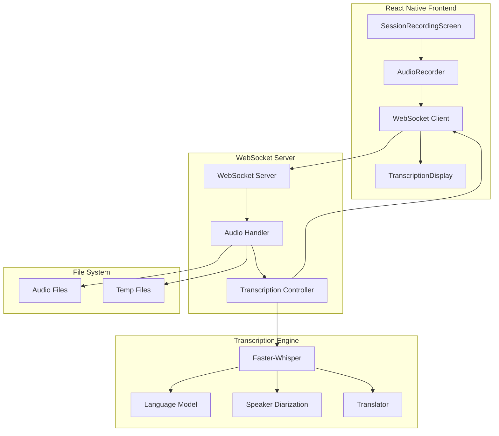

# Design Document: Real-Time Transcription System

## Overview

This design document outlines the architecture and implementation of the real-time speech-to-text transcription system using Faster-Whisper. The system provides live transcription during therapy sessions with support for 90+ languages, automatic translation, speaker diarization, and WebSocket-based streaming for real-time updates.

The real-time transcription system includes:
1. WebSocket server for real-time audio streaming
2. Faster-Whisper integration for multilingual transcription
3. Automatic language detection and translation
4. Speaker diarization for multi-speaker sessions
5. Real-time partial and final transcription updates
6. Audio file processing for pre-recorded sessions

## Architecture



## Components and Interfaces

### 1. Faster-Whisper Configuration

```python
from faster_whisper import WhisperModel

class TranscriptionEngine:
    def __init__(self):
        self.model = WhisperModel(
            "medium",  # Model size
            device="cpu",  # or "cuda" for GPU
            compute_type="int8",  # or "float16" for GPU
            num_workers=4,
            cpu_threads=4
        )
        
    def transcribe(
        self,
        audio_data: bytes,
        language: str = None,
        task: str = "transcribe"  # or "translate"
    ) -> TranscriptionResult:
        """Transcribe audio with optional language and task"""
```

### 2. WebSocket Protocol

```python
# Client → Server Messages

# Audio Chunk (Real-time streaming)
{
    "type": "audio_chunk",
    "data": "base64_encoded_audio",
    "language": "hindi"  # optional
}

# Audio File (Pre-recorded)
{
    "type": "audio_file",
    "data": "data:audio/m4a;base64,..."
}

# Stop Recording
{
    "type": "stop"
}

# Server → Client Messages

# Partial Transcription
{
    "type": "partial",
    "text": "[Person 1]: Transcribed text...",
    "language": "hindi"
}

# Final Transcription
{
    "type": "final",
    "text": "[Person 1]: Complete transcription...\n[Person 2]: Response...",
    "language": "hindi",
    "translated": "English translation...",
    "mode": "multilingual"
}

# Error
{
    "type": "error",
    "message": "Error description"
}

# Connection Confirmation
{
    "type": "connected",
    "message": "WebSocket connected"
}
```

### 3. Speaker Diarization

```python
class SpeakerDiarizer:
    def __init__(self):
        self.silence_threshold = 2.0  # seconds
        self.current_speaker = 1
        
    def detect_speaker_change(
        self,
        audio_segment: np.ndarray,
        previous_segment: np.ndarray
    ) -> bool:
        """Detect speaker change based on silence gaps"""
        
    def label_segments(
        self,
        segments: List[TranscriptionSegment]
    ) -> List[LabeledSegment]:
        """Label segments with speaker IDs"""
        
    def format_with_speakers(
        self,
        segments: List[LabeledSegment]
    ) -> str:
        """Format transcription with [Person N]: labels"""
```

### 4. Language Detection and Translation

```python
class LanguageHandler:
    def __init__(self):
        self.supported_languages = [
            "en", "hi", "ta", "te", "kn", "ml", "bn", "pa",  # Indian
            "es", "fr", "de", "it", "pt",  # European
            "zh", "ja", "ko", "ar", "ru"  # Asian/Other
        ]
        
    def detect_language(
        self,
        audio_data: bytes
    ) -> str:
        """Auto-detect language from audio"""
        
    def translate_to_english(
        self,
        text: str,
        source_language: str
    ) -> str:
        """Translate text to English"""
```

### 5. Audio Processing

```python
class AudioProcessor:
    def __init__(self):
        self.sample_rate = 16000
        self.channels = 1
        self.chunk_duration = 3  # seconds
        
    def decode_base64_audio(
        self,
        base64_data: str
    ) -> np.ndarray:
        """Decode base64 audio to numpy array"""
        
    def resample_audio(
        self,
        audio: np.ndarray,
        original_rate: int
    ) -> np.ndarray:
        """Resample audio to 16kHz"""
        
    def normalize_audio(
        self,
        audio: np.ndarray
    ) -> np.ndarray:
        """Normalize audio amplitude"""
```

## Data Models

### Transcription TypeScript Interfaces (Frontend)

```typescript
interface WebSocketMessage {
    type: 'audio_chunk' | 'audio_file' | 'stop';
    data?: string;
    language?: string;
}

interface TranscriptionUpdate {
    type: 'partial' | 'final' | 'error' | 'connected';
    text?: string;
    language?: string;
    translated?: string;
    mode?: string;
    message?: string;
}

interface TranscriptionState {
    isRecording: boolean;
    isConnected: boolean;
    partialText: string;
    finalText: string;
    language: string;
    error: string | null;
}

interface AudioRecorderConfig {
    sampleRate: 16000;
    channels: 1;
    encoding: 'pcm_16bit';
    chunkDuration: 3000;  // milliseconds
}
```

## Correctness Properties

*A property is a characteristic or behavior that should hold true across all valid executions of a system-essentially, a formal statement about what the system should do. Properties serve as the bridge between human-readable specifications and machine-verifiable correctness guarantees.*

### Property 1: Language Detection Consistency
*For any* audio in a supported language, the detected language should remain consistent across multiple detection attempts on the same audio.
**Validates: Requirements 2.2, 2.3**

### Property 2: Speaker Label Continuity
*For any* transcription with speaker diarization, speaker labels should be sequential (Person 1, Person 2, etc.) without gaps.
**Validates: Requirements 4.2, 4.3**

### Property 3: Translation Preservation
*For any* transcription with translation, the original transcription should be preserved alongside the translation.
**Validates: Requirements 3.2, 3.3, 3.4**

### Property 4: Real-Time Update Ordering
*For any* sequence of partial transcription updates, they should arrive in chronological order matching the audio stream order.
**Validates: Requirements 5.1, 5.2, 5.4**

### Property 5: Audio Format Acceptance
*For any* audio file with .wav, .m4a, or .mp3 extension, the system should accept and process it without format errors.
**Validates: Requirements 6.1, 6.2**

### Property 6: Model Configuration Persistence
*For any* model configuration (device, compute_type), the settings should remain consistent throughout the session.
**Validates: Requirements 7.1, 7.2, 7.3, 7.4**

### Property 7: Performance Target Achievement
*For any* 1-minute audio on CPU, transcription should complete within 60 seconds (1x real-time).
**Validates: Requirements 8.1, 8.4**

### Property 8: Connection State Consistency
*For any* WebSocket connection, the client and server should maintain consistent connection state (connected/disconnected).
**Validates: Requirements 10.1, 10.2, 10.3**

## Error Handling

### Backend Error Handling
- **Connection Errors**: Return error message and close connection gracefully
- **Audio Format Errors**: Return "Invalid audio format" with supported formats
- **Model Errors**: Return "Transcription failed" and log error details
- **Timeout Errors**: Return "Processing timeout" after 60 seconds
- **Memory Errors**: Return "Insufficient memory" and suggest smaller chunks

### Frontend Error Handling
- **Connection Failed**: Show "Cannot connect to transcription server"
- **Disconnection**: Show "Connection lost" and attempt reconnection
- **Audio Permission**: Request microphone permission with explanation
- **Recording Error**: Show "Recording failed" with retry option
- **Format Error**: Show "Unsupported audio format"

## WebSocket Server Implementation

### Server Setup

```python
import asyncio
import websockets
from faster_whisper import WhisperModel

class TranscriptionServer:
    def __init__(self, host="0.0.0.0", port=8003):
        self.host = host
        self.port = port
        self.model = WhisperModel("medium", device="cpu", compute_type="int8")
        
    async def handle_client(self, websocket, path):
        """Handle WebSocket client connection"""
        try:
            await websocket.send(json.dumps({
                "type": "connected",
                "message": "WebSocket connected"
            }))
            
            async for message in websocket:
                await self.process_message(websocket, message)
                
        except websockets.exceptions.ConnectionClosed:
            print("Client disconnected")
        except Exception as e:
            await websocket.send(json.dumps({
                "type": "error",
                "message": str(e)
            }))
            
    async def process_message(self, websocket, message):
        """Process incoming message"""
        data = json.loads(message)
        
        if data["type"] == "audio_chunk":
            await self.process_audio_chunk(websocket, data)
        elif data["type"] == "audio_file":
            await self.process_audio_file(websocket, data)
        elif data["type"] == "stop":
            await self.finalize_transcription(websocket)
            
    def start(self):
        """Start WebSocket server"""
        start_server = websockets.serve(
            self.handle_client,
            self.host,
            self.port
        )
        asyncio.get_event_loop().run_until_complete(start_server)
        asyncio.get_event_loop().run_forever()
```

## Testing Strategy

### Unit Testing
- Test audio decoding and resampling
- Test speaker diarization logic
- Test language detection
- Test translation functionality
- Test WebSocket message parsing

### Property-Based Testing
Using Hypothesis (Python) for backend:

- **Language Detection**: Generate audio in various languages, verify consistent detection
- **Speaker Labeling**: Generate multi-speaker audio, verify sequential labeling
- **Translation Preservation**: Generate transcriptions, translate, verify original preserved
- **Audio Format**: Generate files with various extensions, verify acceptance/rejection
- **Performance**: Generate 1-minute audio samples, verify processing time

### Integration Testing
- Test full WebSocket connection and message flow
- Test real-time audio streaming and transcription
- Test audio file upload and processing
- Test speaker diarization with real audio
- Test language detection and translation
- Test error handling and reconnection

### Performance Testing
- Measure transcription speed on CPU (target: 0.5-1.0x real-time)
- Measure transcription speed on GPU (target: 5-10x real-time)
- Test with various audio lengths (1min, 5min, 10min, 30min)
- Test concurrent connections (multiple clients)
- Monitor memory usage during transcription

## Performance Optimization

### Model Optimization
- **Quantization**: Use INT8 for CPU, FP16 for GPU
- **Batch Processing**: Process multiple chunks together
- **Model Caching**: Keep model loaded in memory
- **Beam Size**: Adjust beam size for speed/accuracy tradeoff

### Audio Processing
- **Chunk Size**: Optimize chunk duration (3 seconds)
- **Buffering**: Use circular buffer for streaming
- **Resampling**: Pre-resample to 16kHz
- **Compression**: Use efficient audio encoding

### WebSocket Optimization
- **Message Batching**: Batch partial updates
- **Compression**: Enable WebSocket compression
- **Connection Pooling**: Reuse connections
- **Async Processing**: Use async/await throughout

## Security Considerations

### Data Privacy
- **Local Processing**: All transcription done locally
- **No External APIs**: No data sent to external services
- **Temporary Files**: Clean up temp audio files after processing
- **HIPAA Compliance**: Patient audio never leaves local infrastructure

### Connection Security
- **WSS**: Use secure WebSocket (WSS) in production
- **Authentication**: Verify JWT token on WebSocket connection
- **Rate Limiting**: Limit connections per therapist
- **Input Validation**: Validate all audio data before processing

## Deployment Considerations

### System Requirements

```bash
# CPU Deployment
CPU: 4+ cores
RAM: 4GB minimum, 8GB recommended
Storage: 2GB for model
Network: Local WiFi

# GPU Deployment (Optional)
GPU: NVIDIA with CUDA support
VRAM: 2GB minimum
CUDA: 11.0+
cuDNN: 8.0+
```

### Installation

```bash
# Install Faster-Whisper
pip install faster-whisper

# Install WebSocket support
pip install websockets

# Install audio processing
pip install numpy soundfile

# Download Whisper model (automatic on first run)
# Model will be cached in ~/.cache/huggingface/
```

### Configuration

```bash
# WebSocket Server
WS_HOST=0.0.0.0
WS_PORT=8003

# Whisper Model
WHISPER_MODEL=medium
WHISPER_DEVICE=cpu
WHISPER_COMPUTE_TYPE=int8
WHISPER_NUM_WORKERS=4
WHISPER_CPU_THREADS=4

# Audio Processing
AUDIO_SAMPLE_RATE=16000
AUDIO_CHANNELS=1
CHUNK_DURATION=3
```

### Monitoring
- **Connection Count**: Track active WebSocket connections
- **Transcription Rate**: Monitor transcriptions per minute
- **Error Rate**: Track transcription failures
- **Performance**: Monitor average transcription time
- **Resource Usage**: Monitor CPU/GPU and memory usage
