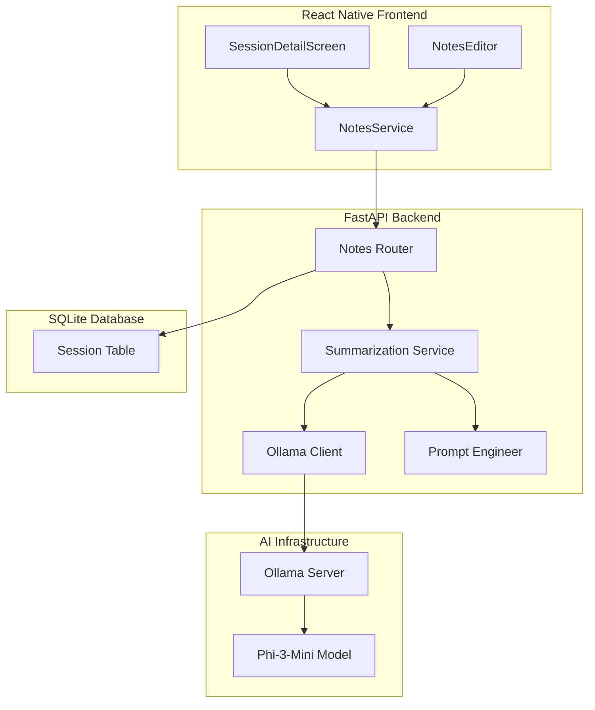

# Design Document: AI Notes Generation System

## Overview

This design document outlines the architecture and implementation of the AI-powered clinical notes generation system using Phi-3-Mini language model via Ollama. The system automatically generates structured, professional clinical summaries from therapy session transcriptions with risk keyword highlighting and supports post-generation editing.

The AI notes generation system includes:
1. Automated clinical note generation from transcriptions using Phi-3-Mini
2. Structured output with professional clinical format
3. Risk keyword detection and highlighting
4. Note regeneration capability
5. Edit tracking with metadata
6. Fast inference (10-15 seconds on CPU, 2-4 seconds on GPU)

## Architecture



## Components and Interfaces

### 1. Summarization Service (Backend)

```python
class SummarizationService:
    def __init__(self):
        self.ollama_url = "http://localhost:11434"
        self.model_name = "phi3:mini"
        self.max_tokens = 150
        self.temperature = 0.7
        self.timeout = 45
        
    def generate_session_notes(
        self,
        transcription: str,
        session_number: int,
        session_date: str
    ) -> str:
        """Generate clinical notes from transcription"""
        
    def detect_risk_keywords(self, text: str) -> str:
        """Detect and highlight risk keywords"""
        
    def format_notes(self, raw_output: str) -> str:
        """Format notes with markdown"""
```

### 2. Prompt Template

```python
CLINICAL_NOTES_PROMPT = """<|system|>
You are a therapy session summarizer. Create concise clinical summaries using this format:

**Chief Complaint:** [main issue in 1-2 words]
**Emotional State:** [current mood in 1-2 words]
**Risk:** [safety concerns - use {{RED:text}} for urgent keywords]
**Intervention:** [what was done in session]
**Progress:** [client progress]
**Plan:** [next steps]

CRITICAL: Highlight urgent keywords with {{RED:keyword}}:
- suicide, self-harm, kill, hurt myself
- violence, abuse, assault
- overdose, substance abuse

Keep each section under 50 words. Be concise and professional.<|end|>
<|user|>
Session #{session_number} | Date: {session_date}

Transcription:
{transcription}<|end|>
<|assistant|>
"""
```

### 3. Risk Keywords

```python
RISK_KEYWORDS = [
    "suicide", "suicidal",
    "self-harm", "self harm", "cut myself", "hurt myself",
    "kill", "killing", "death wish",
    "violence", "violent", "assault",
    "abuse", "abusive",
    "overdose", "od"
]

def highlight_risk_keywords(text: str) -> str:
    """Replace risk keywords with {{RED:keyword}} format"""
    for keyword in RISK_KEYWORDS:
        pattern = re.compile(re.escape(keyword), re.IGNORECASE)
        text = pattern.sub(f"{{{{RED:{keyword}}}}}", text)
    return text
```

### 4. Notes API Endpoints

```python
# Generate Notes
POST /notes/{session_id}/generate-notes
Request: {
    regenerate: bool  # Whether to regenerate existing notes
}
Response: {
    success: bool,
    session_id: int,
    notes: str,  # Formatted clinical notes
    is_ai_generated: bool,
    generated_at: str,
    can_edit: bool
}

# Update Notes
PUT /notes/{session_id}/notes
Request: {
    notes: str,
    is_ai_generated: bool,
    edited_from_ai: bool
}
Response: {
    success: bool,
    message: str,
    session: SessionDetail
}

# Get Session with Notes
GET /notes/{session_id}
Response: {
    success: bool,
    session: SessionWithNotes
}
```

### 5. Frontend Notes Service

```typescript
interface NotesService {
    generateNotes(sessionId: number, regenerate?: boolean): Promise<NotesResponse>;
    updateNotes(sessionId: number, notes: string, metadata: NotesMetadata): Promise<UpdateResponse>;
    getSessionNotes(sessionId: number): Promise<SessionNotesResponse>;
}

interface NotesMetadata {
    is_ai_generated: boolean;
    edited_from_ai: boolean;
}
```

## Data Models

### Notes TypeScript Interfaces (Frontend)

```typescript
interface NotesResponse {
    success: boolean;
    session_id: number;
    notes: string;
    is_ai_generated: boolean;
    generated_at: string;
    can_edit: boolean;
}

interface SessionWithNotes {
    id: number;
    session_number: number;
    session_date: string;
    notes: string;
    notes_is_ai_generated: boolean;
    notes_edited_from_ai: boolean;
    notes_generated_at?: string;
    notes_last_edited_at?: string;
}

interface NotesEditorProps {
    initialNotes: string;
    isAIGenerated: boolean;
    onSave: (notes: string) => Promise<void>;
    onRegenerate: () => Promise<void>;
}
```

## Correctness Properties

*A property is a characteristic or behavior that should hold true across all valid executions of a system-essentially, a formal statement about what the system should do. Properties serve as the bridge between human-readable specifications and machine-verifiable correctness guarantees.*

### Property 1: Notes Structure Completeness
*For any* generated clinical notes, the output should contain all required sections: Chief Complaint, Emotional State, Risk, Intervention, Progress, and Plan.
**Validates: Requirements 1.3, 1.5**

### Property 2: Risk Keyword Highlighting
*For any* text containing risk keywords (suicide, self-harm, violence, abuse, overdose), the formatted output should wrap those keywords in {{RED:keyword}} format.
**Validates: Requirements 2.1, 2.2, 2.3**

### Property 3: Generation Time Limit
*For any* note generation request, the system should complete within 30 seconds or return a timeout error.
**Validates: Requirements 1.2, 8.1, 8.2**

### Property 4: Metadata Flag Consistency
*For any* AI-generated notes, the is_ai_generated flag should be true and notes_generated_at should be set to the generation timestamp.
**Validates: Requirements 5.1, 5.4**

### Property 5: Edit Tracking
*For any* AI-generated notes that are edited, the edited_from_ai flag should be set to true and notes_last_edited_at should be updated.
**Validates: Requirements 3.3, 3.4, 5.3, 5.5**

### Property 6: Regeneration Replaces Notes
*For any* regeneration request, the new notes should completely replace existing notes and reset the edited_from_ai flag to false.
**Validates: Requirements 4.2, 4.3, 4.4**

### Property 7: Markdown Formatting Preservation
*For any* notes with markdown formatting (**bold** and {{RED:text}}), editing and saving should preserve the formatting syntax.
**Validates: Requirements 3.2, 1.4**

### Property 8: Error Preserves Existing Notes
*For any* generation failure, the existing notes (if any) should remain unchanged in the database.
**Validates: Requirements 4.5, 7.4**

## Error Handling

### Backend Error Handling
- **Ollama Unavailable**: Return 503 with "AI service unavailable"
- **Timeout**: Return 504 with "Generation timed out" after 30 seconds
- **Model Error**: Return 500 with "AI generation failed"
- **Invalid Session**: Return 404 with "Session not found"
- **Empty Transcription**: Return 400 with "No transcription available"

### Frontend Error Handling
- **Generation Failure**: Show error message with retry option
- **Timeout**: Show "Generation taking too long, please try again"
- **Network Error**: Show "Connection failed" with retry
- **Save Error**: Show "Failed to save notes" with retry
- **Validation Error**: Show field-specific errors

## Ollama Integration

### Configuration

```python
# Ollama Settings
OLLAMA_BASE_URL = "http://localhost:11434"
MODEL_NAME = "phi3:mini"
MAX_TOKENS = 150
TEMPERATURE = 0.7
TOP_P = 0.9
TIMEOUT = 45  # seconds

# Request Format
{
    "model": "phi3:mini",
    "prompt": "<formatted_prompt>",
    "stream": false,
    "options": {
        "num_predict": 150,
        "temperature": 0.7,
        "top_p": 0.9
    }
}
```

### Model Loading

```python
# Ensure model is loaded
def ensure_model_loaded():
    """Check if Phi-3-Mini is loaded in Ollama"""
    response = requests.get(f"{OLLAMA_BASE_URL}/api/tags")
    models = response.json().get("models", [])
    if "phi3:mini" not in [m["name"] for m in models]:
        raise Exception("Phi-3-Mini model not found in Ollama")
```

## Testing Strategy

### Unit Testing
- Test prompt template formatting
- Test risk keyword detection
- Test markdown formatting
- Test metadata flag updates
- Test error handling

### Property-Based Testing
Using Hypothesis (Python) for backend:

- **Notes Structure**: Generate random transcriptions, verify all sections present
- **Risk Highlighting**: Generate text with risk keywords, verify {{RED:}} formatting
- **Metadata Tracking**: Generate notes, edit them, verify flags updated correctly
- **Regeneration**: Generate notes, regenerate, verify old notes replaced
- **Error Handling**: Simulate Ollama failures, verify existing notes preserved

### Integration Testing
- Test full generation flow from frontend to Ollama
- Test note editing and metadata updates
- Test regeneration with existing notes
- Test risk keyword highlighting in real notes
- Test timeout handling with slow responses

### Performance Testing
- Measure generation time on CPU (target: <15s)
- Measure generation time on GPU (target: <5s)
- Test concurrent generation requests
- Test with various transcription lengths
- Monitor memory usage during generation

## Performance Optimization

### Caching
- **Model Loading**: Keep Phi-3-Mini loaded in Ollama
- **Prompt Templates**: Cache compiled prompt templates
- **Risk Keywords**: Pre-compile regex patterns

### Async Processing
- Use async HTTP client for Ollama requests
- Process multiple generation requests concurrently
- Queue requests if Ollama is busy

### Resource Management
- **CPU**: Use 4-6 threads for inference
- **GPU**: Use FP16 precision for faster inference
- **Memory**: Monitor and limit concurrent requests

## Security Considerations

### Data Privacy
- **Local Processing**: All AI inference done locally via Ollama
- **No External APIs**: No data sent to external services
- **HIPAA Compliance**: Patient data never leaves local infrastructure

### Input Validation
- **Transcription Length**: Limit to 4000 tokens (Phi-3 context window)
- **Injection Prevention**: Sanitize transcription before prompt injection
- **Output Validation**: Verify generated notes are properly formatted

## Deployment Considerations

### Ollama Setup

```bash
# Install Ollama
curl https://ollama.ai/install.sh | sh

# Pull Phi-3-Mini model
ollama pull phi3:mini

# Start Ollama server
ollama serve
```

### Environment Configuration

```bash
OLLAMA_BASE_URL=http://localhost:11434
PHI3_MODEL_NAME=phi3:mini
PHI3_MAX_TOKENS=150
PHI3_TEMPERATURE=0.7
PHI3_TIMEOUT=45
```

### Monitoring
- **Generation Success Rate**: Track successful vs failed generations
- **Average Generation Time**: Monitor inference performance
- **Error Rates**: Track Ollama connection and timeout errors
- **Model Health**: Monitor Ollama server status
