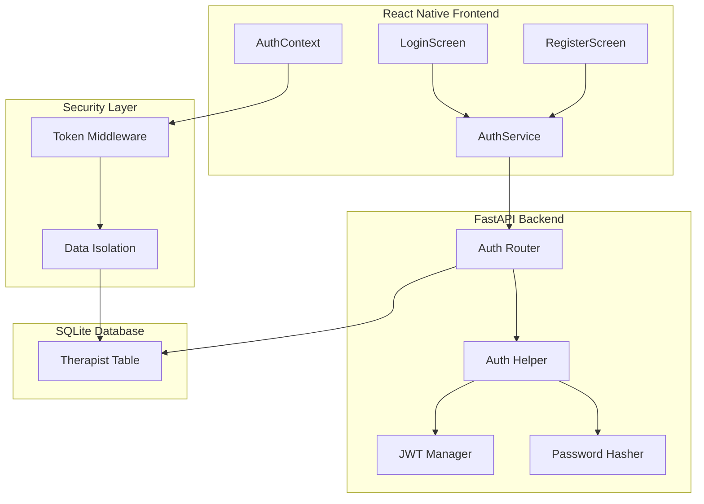

# Design Document: Authentication System

## Overview

This design document outlines the architecture and implementation of the JWT-based authentication system for the Auralis platform. The system provides secure therapist authentication, token-based authorization, password hashing with bcrypt, and data isolation to ensure HIPAA compliance.

The authentication system includes:
1. Therapist registration with professional credentials
2. Secure login with JWT token generation
3. Token-based authorization for all protected endpoints
4. Password hashing using bcrypt with salt
5. Data isolation ensuring therapists only access their own data

## Architecture



## Components and Interfaces

### 1. Therapist Model (Backend)

```python
class Therapist(Base):
    __tablename__ = "therapists"
    
    id: int  # Primary key
    email: str  # Unique, required
    username: str  # Unique, required
    hashed_password: str  # bcrypt hash, required
    full_name: str  # Required
    license_number: str  # Optional
    specialization: str  # Optional
    phone: str  # Optional
    is_active: bool  # Default True
    is_verified: bool  # Default False
    created_at: datetime
    last_login: datetime
    
    # Relationships
    patients: List[Patient]  # One-to-many
```

### 2. Authentication API Endpoints

```python
# Registration
POST /auth/register
Request: {
    email: str,
    username: str,
    password: str,
    full_name: str,
    license_number?: str,
    specialization?: str,
    phone?: str
}
Response: {
    success: bool,
    message: str,
    therapist: TherapistProfile
}

# Login
POST /auth/login
Request: {
    username: str,
    password: str
}
Response: {
    access_token: str,
    token_type: "bearer",
    therapist: TherapistProfile
}

# Get Current User
GET /auth/me
Headers: { Authorization: "Bearer <token>" }
Response: {
    id: int,
    email: str,
    username: str,
    full_name: str,
    patient_count: int
}

# Logout
POST /auth/logout
Response: {
    success: bool,
    message: str
}
```

### 3. JWT Token Structure

```python
# Token Payload
{
    "sub": "username",  # Subject (username)
    "therapist_id": 1,  # Therapist ID for data isolation
    "exp": 1732723200,  # Expiration (24 hours)
    "iat": 1732636800   # Issued at
}

# Token Configuration
SECRET_KEY: str  # From environment variable
ALGORITHM: "HS256"
ACCESS_TOKEN_EXPIRE_HOURS: 24
```

### 4. Password Security

```python
# bcrypt Configuration
BCRYPT_ROUNDS: 12  # Cost factor
SALT: auto-generated per password

# Password Hashing
def hash_password(password: str) -> str:
    salt = bcrypt.gensalt(rounds=12)
    return bcrypt.hashpw(password.encode(), salt).decode()

# Password Verification
def verify_password(plain: str, hashed: str) -> bool:
    return bcrypt.checkpw(plain.encode(), hashed.encode())
```

### 5. Frontend Authentication Service

```typescript
interface AuthService {
    register(data: RegisterData): Promise<AuthResponse>;
    login(username: string, password: string): Promise<AuthResponse>;
    logout(): Promise<void>;
    getCurrentUser(): Promise<TherapistProfile>;
    getToken(): string | null;
    setToken(token: string): void;
    removeToken(): void;
    isAuthenticated(): boolean;
}

interface AuthContext {
    therapist: TherapistProfile | null;
    token: string | null;
    loading: boolean;
    login: (username: string, password: string) => Promise<void>;
    logout: () => Promise<void>;
    register: (data: RegisterData) => Promise<void>;
}
```

## Data Models

### Therapist TypeScript Interface (Frontend)

```typescript
interface TherapistProfile {
    id: number;
    email: string;
    username: string;
    full_name: string;
    license_number?: string;
    specialization?: string;
    phone?: string;
    is_active: boolean;
    is_verified: boolean;
    created_at: string;
    last_login?: string;
    patient_count?: number;
}

interface RegisterData {
    email: string;
    username: string;
    password: string;
    full_name: string;
    license_number?: string;
    specialization?: string;
    phone?: string;
}

interface LoginCredentials {
    username: string;
    password: string;
}

interface AuthResponse {
    access_token: string;
    token_type: string;
    therapist: TherapistProfile;
}
```

## Correctness Properties

*A property is a characteristic or behavior that should hold true across all valid executions of a system-essentially, a formal statement about what the system should do. Properties serve as the bridge between human-readable specifications and machine-verifiable correctness guarantees.*

### Property 1: Password Hash Uniqueness
*For any* two identical passwords hashed separately, the resulting hashes should be different due to unique salts.
**Validates: Requirements 6.2**

### Property 2: Password Verification Consistency
*For any* password and its hash, verifying the password against the hash should always return true, and verifying any other password should return false.
**Validates: Requirements 6.3**

### Property 3: Token Contains Therapist ID
*For any* successful login, the generated JWT token payload should contain the therapist ID matching the authenticated user.
**Validates: Requirements 3.5**

### Property 4: Token Expiration Enforcement
*For any* token with expired timestamp, validation should fail and return 401 Unauthorized.
**Validates: Requirements 3.3**

### Property 5: Data Isolation by Therapist
*For any* API request with valid token, the system should only return data belonging to the therapist identified in the token.
**Validates: Requirements 7.1, 7.2, 7.3**

### Property 6: Registration Uniqueness
*For any* registration attempt with existing email or username, the system should reject with appropriate error message.
**Validates: Requirements 1.5**

### Property 7: Login Updates Timestamp
*For any* successful login, the therapist's last_login timestamp should be updated to the current time.
**Validates: Requirements 2.3**

### Property 8: Token Validation Rejects Invalid Tokens
*For any* malformed, expired, or tampered token, validation should fail and return 401 Unauthorized.
**Validates: Requirements 3.3, 3.4**

## Error Handling

### Backend Error Handling
- **Validation Errors**: Return 422 with field-level validation errors
- **Duplicate Registration**: Return 400 with "Email/username already exists"
- **Invalid Credentials**: Return 401 with "Invalid username or password"
- **Expired Token**: Return 401 with "Token has expired"
- **Invalid Token**: Return 401 with "Invalid authentication token"
- **Missing Token**: Return 401 with "Authentication required"

### Frontend Error Handling
- **Network Errors**: Show "Connection failed" with retry option
- **Invalid Credentials**: Show "Invalid username or password"
- **Registration Errors**: Display field-specific validation errors
- **Token Expiration**: Auto-logout and redirect to login
- **Session Timeout**: Show "Session expired, please login again"

## Security Features

### Password Security
- **Hashing Algorithm**: bcrypt with cost factor 12
- **Salt**: Unique random salt per password
- **Storage**: Never store plain text passwords
- **Transmission**: Only over HTTPS in production
- **Validation**: Constant-time comparison to prevent timing attacks

### Token Security
- **Algorithm**: HS256 (HMAC with SHA-256)
- **Secret Key**: Strong random key from environment variable
- **Expiration**: 24 hours from issuance
- **Storage**: Secure local storage on mobile device
- **Transmission**: Bearer token in Authorization header

### Data Isolation
- **Therapist ID**: Extracted from validated token
- **Query Filtering**: All queries filtered by therapist_id
- **Authorization**: Verify ownership before any data access
- **Error Handling**: Return 404 (not 403) to prevent information leakage

## Testing Strategy

### Unit Testing
- Test password hashing produces different hashes for same password
- Test password verification with correct and incorrect passwords
- Test JWT token generation and validation
- Test token expiration logic
- Test data isolation filtering

### Property-Based Testing
Using Hypothesis (Python) for backend and fast-check (TypeScript) for frontend:

- **Password Hash Uniqueness**: Generate random passwords, hash twice, verify different hashes
- **Password Verification**: Generate random passwords, hash and verify, test with wrong passwords
- **Token Payload**: Generate random therapist data, create token, verify payload contains correct ID
- **Token Expiration**: Generate tokens with various expiration times, verify validation behavior
- **Data Isolation**: Generate random therapist IDs, verify queries only return matching data

### Integration Testing
- Test full registration flow from frontend to database
- Test login flow with token generation and storage
- Test protected endpoint access with valid and invalid tokens
- Test token expiration and re-authentication
- Test data isolation across multiple therapists

### Security Testing
- Test SQL injection prevention in login
- Test password brute force protection (rate limiting)
- Test token tampering detection
- Test cross-therapist data access prevention
- Test session fixation prevention

## Performance Considerations

### Password Hashing
- **bcrypt Cost Factor**: 12 (balance between security and performance)
- **Expected Time**: 100-300ms per hash/verify operation
- **Async Processing**: Use async bcrypt to avoid blocking

### Token Operations
- **Generation**: <10ms per token
- **Validation**: <5ms per validation
- **Caching**: Cache decoded tokens for request duration

### Database Queries
- **Indexes**: Create indexes on email, username, therapist_id
- **Connection Pooling**: Use SQLAlchemy connection pool
- **Query Optimization**: Use selective field loading

## Deployment Considerations

### Environment Variables
```bash
SECRET_KEY=<strong-random-key>
ALGORITHM=HS256
ACCESS_TOKEN_EXPIRE_HOURS=24
BCRYPT_ROUNDS=12
```

### HIPAA Compliance
- **Encryption**: All data encrypted at rest and in transit
- **Audit Trail**: Log all authentication events
- **Access Control**: Role-based access (future enhancement)
- **Session Management**: Automatic timeout after 24 hours
- **Password Policy**: Enforce strong password requirements (future)

### Monitoring
- **Failed Login Attempts**: Track and alert on suspicious activity
- **Token Usage**: Monitor token generation and validation rates
- **Session Duration**: Track average session lengths
- **Error Rates**: Monitor authentication error rates
