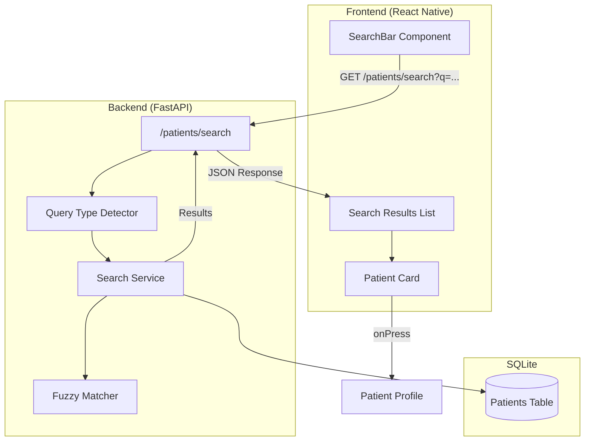

# Design Document: Patient Search Feature

## Overview

The Patient Search feature provides a unified, intelligent search bar that allows therapists to quickly find patients using any of three identifiers: patient name, phone number, or 6-digit patient ID. The system automatically detects the query type and returns relevant results with real-time feedback.

The implementation follows a client-server architecture where:
- Backend provides a search API endpoint with multi-field matching and fuzzy search capabilities
- Frontend implements a responsive search UI component integrated into the PatientListScreen

## Architecture



## Components and Interfaces

### Backend Components

#### 1. Search Endpoint (`/patients/search`)

```python
@router.get("/search")
async def search_patients(
    q: str = Query(..., min_length=2, description="Search query"),
    current_therapist: Therapist = Depends(get_current_therapist),
    db: Session = Depends(get_db)
) -> SearchResponse
```

#### 2. Query Type Detector

Determines the type of search based on input pattern:

```python
class QueryType(Enum):
    PATIENT_ID = "patient_id"      # Alphanumeric, matches ID format
    PHONE = "phone"                 # Digits only (3+ digits)
    NAME = "name"                   # Letters and spaces
    MIXED = "mixed"                 # Alphanumeric (search ID + name)

def detect_query_type(query: str) -> QueryType:
    """Detect the type of search query based on content patterns."""
```

#### 3. Search Service

Core search logic with multi-field matching:

```python
class PatientSearchService:
    def search(
        self, 
        query: str, 
        therapist_id: int, 
        db: Session
    ) -> List[SearchResult]:
        """
        Search patients across multiple fields with relevance scoring.
        Returns results sorted by relevance (exact matches first).
        """
    
    def normalize_phone(self, phone: str) -> str:
        """Remove formatting characters from phone numbers."""
    
    def calculate_relevance(
        self, 
        patient: Patient, 
        query: str, 
        query_type: QueryType
    ) -> float:
        """Calculate relevance score for sorting results."""
```

#### 4. Fuzzy Matcher

Simple fuzzy matching for name searches:

```python
def fuzzy_match(query: str, target: str, threshold: float = 0.6) -> bool:
    """
    Check if query fuzzy-matches target string.
    Uses simple character-based similarity for typo tolerance.
    """
```

### Frontend Components

#### 1. SearchBar Component

```typescript
interface SearchBarProps {
  value: string;
  onChangeText: (text: string) => void;
  onClear: () => void;
  isLoading: boolean;
  placeholder?: string;
}

const SearchBar: React.FC<SearchBarProps>
```

#### 2. Updated PatientListScreen

Integrates search functionality with existing patient list:

```typescript
// State additions
const [searchQuery, setSearchQuery] = useState('');
const [searchResults, setSearchResults] = useState<Patient[]>([]);
const [isSearching, setIsSearching] = useState(false);

// Debounced search effect
useEffect(() => {
  const debounceTimer = setTimeout(() => {
    if (searchQuery.length >= 2) {
      performSearch(searchQuery);
    } else {
      setSearchResults([]);
    }
  }, 300);
  return () => clearTimeout(debounceTimer);
}, [searchQuery]);
```

#### 3. Highlight Utility

```typescript
interface HighlightMatch {
  start: number;
  end: number;
}

function findMatchPositions(text: string, query: string): HighlightMatch[];
function highlightText(text: string, query: string): React.ReactNode;
```

## Data Models

### Search Request

```typescript
// Frontend
interface SearchRequest {
  q: string;  // Search query (min 2 characters)
}
```

### Search Response

```python
# Backend
class SearchResult(BaseModel):
    patient: PatientDict
    relevance_score: float
    match_field: str  # "patient_id", "name", or "phone"
    match_positions: List[Dict[str, int]]  # For highlighting

class SearchResponse(BaseModel):
    success: bool
    query: str
    query_type: str
    count: int
    results: List[SearchResult]
```

```typescript
// Frontend
interface SearchResult {
  patient: Patient;
  relevance_score: number;
  match_field: 'patient_id' | 'name' | 'phone';
  match_positions: Array<{ start: number; end: number }>;
}

interface SearchResponse {
  success: boolean;
  query: string;
  query_type: string;
  count: number;
  results: SearchResult[];
}
```

## Correctness Properties

*A property is a characteristic or behavior that should hold true across all valid executions of a system-essentially, a formal statement about what the system should do. Properties serve as the bridge between human-readable specifications and machine-verifiable correctness guarantees.*

### Property 1: Search results contain query match

*For any* patient list and any search query (2+ characters), all returned patients SHALL have at least one field (name, phone, or patient_id) that contains or fuzzy-matches the query.

**Validates: Requirements 1.1, 2.1**

### Property 2: Phone number normalization consistency

*For any* phone number string, normalizing it (removing spaces, dashes, parentheses) and then searching SHALL return the same results as searching with the original formatted number.

**Validates: Requirements 3.3**

### Property 3: Exact patient ID match prioritization

*For any* search query that exactly matches a patient's ID, that patient SHALL appear first in the results (highest relevance score).

**Validates: Requirements 4.1, 4.2**

### Property 4: Query type detection correctness

*For any* search query:
- If query contains only digits (3+), query type SHALL be PHONE
- If query contains only letters and spaces, query type SHALL be NAME  
- If query contains letters and numbers, query type SHALL be MIXED or PATIENT_ID

**Validates: Requirements 5.1, 5.2, 5.3, 5.4**

### Property 5: Fuzzy name matching tolerance

*For any* patient name and a query that is the name with a single character substitution, deletion, or insertion, the search SHALL still return that patient.

**Validates: Requirements 2.2**

### Property 6: Empty query returns all patients

*For any* patient list, when the search query is empty or less than 2 characters, the system SHALL return all active patients (no filtering).

**Validates: Requirements 1.2**

### Property 7: Highlight positions validity

*For any* search result with match positions, each position SHALL be a valid index range within the matched field's text.

**Validates: Requirements 6.3**

## Error Handling

| Error Scenario | Backend Response | Frontend Handling |
|----------------|------------------|-------------------|
| Query too short (<2 chars) | 400 Bad Request | Show minimum length hint |
| No results found | 200 with empty results | Show "No patients found" message |
| Database error | 500 Internal Error | Show generic error, allow retry |
| Network timeout | N/A | Show connection error, allow retry |
| Unauthorized | 401 Unauthorized | Redirect to login |

## Testing Strategy

### Unit Tests

1. **Query Type Detection**: Test detection logic with various input patterns
2. **Phone Normalization**: Test removal of formatting characters
3. **Relevance Scoring**: Test scoring algorithm with known inputs
4. **Highlight Positions**: Test match position calculation

### Property-Based Tests

The implementation SHALL use `hypothesis` (Python) for backend property tests and `fast-check` (TypeScript) for frontend property tests.

Each property-based test SHALL:
- Run a minimum of 100 iterations
- Be tagged with the format: `**Feature: patient-search, Property {number}: {property_text}**`
- Reference the specific correctness property from this design document

**Backend Property Tests (Python/Hypothesis):**
- Property 1: Search results validity
- Property 2: Phone normalization consistency  
- Property 3: Exact ID match prioritization
- Property 4: Query type detection
- Property 5: Fuzzy matching tolerance
- Property 6: Empty query behavior

**Frontend Property Tests (TypeScript/fast-check):**
- Property 7: Highlight positions validity

### Integration Tests

1. End-to-end search flow with real database
2. Authentication integration (only therapist's patients returned)
3. Debounce behavior verification
