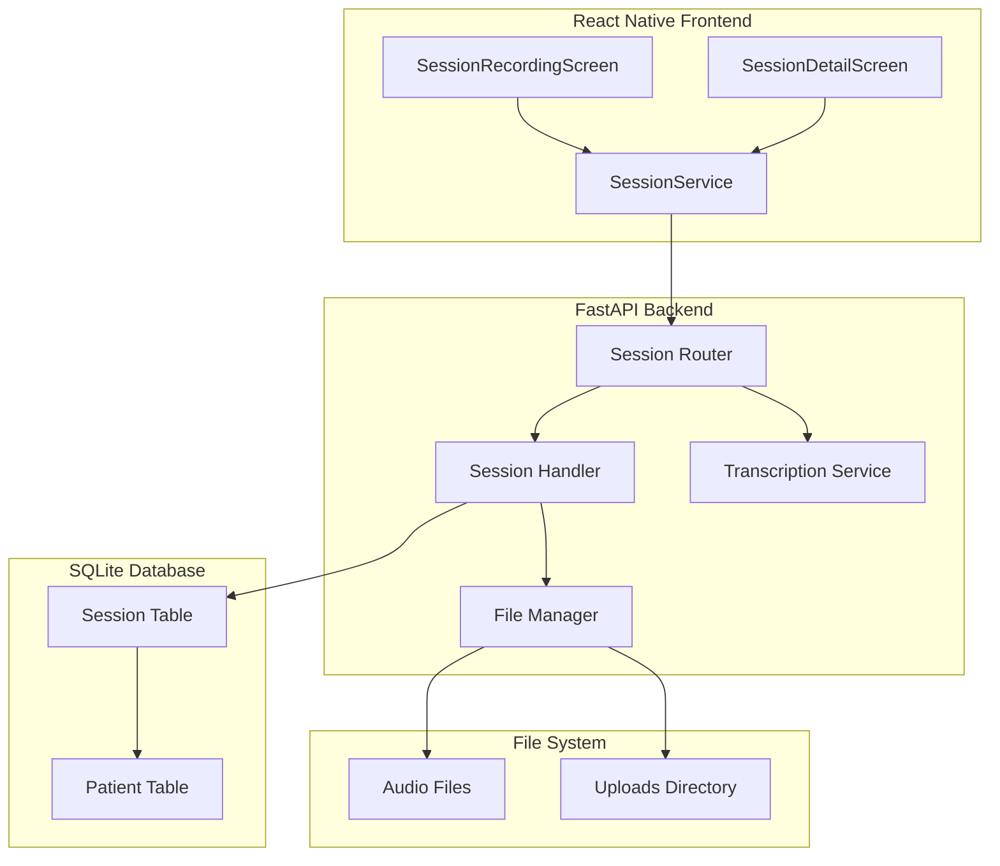

# Design Document: Session Management System

## Overview

This design document outlines the architecture and implementation of the comprehensive session management system for therapy sessions in the Auralis platform. The system handles session creation, audio file uploads, transcription storage, metadata tracking, and session lifecycle management.

The session management system includes:
1. Session creation with auto-incrementing session numbers per patient
2. Audio file upload and storage (WAV, M4A, MP3)
3. Transcription and translation storage
4. Session metadata tracking (AI generation, edit history)
5. Session retrieval, updates, and deletion
6. Data isolation ensuring therapists only access their patients' sessions

## Architecture



## Components and Interfaces

### 1. Session Model (Backend)

```python
class Session(Base):
    __tablename__ = "sessions"
    
    id: int  # Primary key
    patient_id: int  # Foreign key to Patient
    session_number: int  # Auto-increment per patient
    session_date: datetime  # Date and time of session
    duration: int  # Duration in seconds
    language: str  # Language of session (e.g., "hindi", "english")
    
    # Transcription fields
    original_transcription: str  # Original language transcription
    translated_transcription: str  # English translation
    translation_language: str  # Target language for translation
    
    # Audio file fields
    audio_file_path: str  # Path to audio file
    audio_file_size: int  # File size in bytes
    
    # Clinical notes fields
    notes: str  # Clinical notes (AI-generated or manual)
    diagnosis: str  # Diagnosis
    treatment_plan: str  # Treatment plan
    
    # Status fields
    is_completed: bool  # Session completion status
    
    # AI metadata fields
    notes_is_ai_generated: bool  # Whether notes are AI-generated
    notes_edited_from_ai: bool  # Whether AI notes were edited
    notes_generated_at: datetime  # When notes were generated
    notes_last_edited_at: datetime  # Last edit timestamp
    
    # Timestamps
    created_at: datetime
    updated_at: datetime
    
    # Relationships
    patient: Patient  # Many-to-one
```

### 2. Session API Endpoints

```python
# Create Session
POST /sessions/
Request: {
    patient_id: int,
    language: str,
    duration: int,
    original_transcription: str,
    translated_transcription?: str,
    notes?: str
}
Response: {
    success: bool,
    message: str,
    session: SessionDetail
}

# Get Patient Sessions
GET /sessions/patient/{patient_id}
Response: {
    success: bool,
    count: int,
    sessions: List[SessionSummary]
}

# Get Session Details
GET /sessions/{session_id}
Response: {
    success: bool,
    session: SessionDetail
}

# Update Session
PUT /sessions/{session_id}
Request: {
    original_transcription?: str,
    notes?: str,
    diagnosis?: str,
    treatment_plan?: str,
    is_completed?: bool
}
Response: {
    success: bool,
    message: str,
    session: SessionDetail
}

# Upload Audio File
POST /sessions/{session_id}/audio
Content-Type: multipart/form-data
Form Data: { file: File }
Response: {
    success: bool,
    message: str,
    file_path: str,
    file_size: int
}

# Delete Session
DELETE /sessions/{session_id}
Response: {
    success: bool,
    message: str
}
```

### 3. Session Number Auto-Increment Logic

```python
def get_next_session_number(patient_id: int, db: Session) -> int:
    """Get next session number for patient"""
    max_session = db.query(func.max(Session.session_number))\
        .filter(Session.patient_id == patient_id)\
        .scalar()
    return (max_session or 0) + 1
```

### 4. Audio File Management

```python
# File Storage Structure
uploads/
  sessions/
    {patient_id}/
      session_{session_number}_{uuid}.{ext}

# Supported Formats
ALLOWED_EXTENSIONS = ['.wav', '.m4a', '.mp3']
MAX_FILE_SIZE = 500 * 1024 * 1024  # 500MB

# File Operations
def save_audio_file(file: UploadFile, patient_id: int, session_number: int) -> tuple[str, int]:
    """Save audio file and return path and size"""
    
def delete_audio_file(file_path: str) -> bool:
    """Delete audio file from storage"""
```

### 5. Frontend Session Service

```typescript
interface SessionService {
    createSession(data: CreateSessionData): Promise<SessionResponse>;
    getPatientSessions(patientId: number): Promise<SessionListResponse>;
    getSession(sessionId: number): Promise<SessionDetailResponse>;
    updateSession(sessionId: number, data: UpdateSessionData): Promise<SessionResponse>;
    uploadAudio(sessionId: number, audioFile: File): Promise<UploadResponse>;
    deleteSession(sessionId: number): Promise<DeleteResponse>;
}
```

## Data Models

### Session TypeScript Interfaces (Frontend)

```typescript
interface Session {
    id: number;
    patient_id: number;
    session_number: number;
    session_date: string;
    duration: number;
    language: string;
    original_transcription?: string;
    translated_transcription?: string;
    translation_language?: string;
    audio_file_path?: string;
    audio_file_size?: number;
    notes?: string;
    diagnosis?: string;
    treatment_plan?: string;
    is_completed: boolean;
    notes_is_ai_generated: boolean;
    notes_edited_from_ai: boolean;
    notes_generated_at?: string;
    notes_last_edited_at?: string;
    created_at: string;
    updated_at: string;
}

interface CreateSessionData {
    patient_id: number;
    language: string;
    duration: number;
    original_transcription: string;
    translated_transcription?: string;
    notes?: string;
}

interface UpdateSessionData {
    original_transcription?: string;
    notes?: string;
    diagnosis?: string;
    treatment_plan?: string;
    is_completed?: boolean;
}

interface SessionSummary {
    id: number;
    session_number: number;
    session_date: string;
    duration: number;
    language: string;
    is_completed: boolean;
    has_notes: boolean;
}

interface SessionDetail extends Session {
    patient_name: string;
    therapist_name: string;
}
```

## Correctness Properties

*A property is a characteristic or behavior that should hold true across all valid executions of a system-essentially, a formal statement about what the system should do. Properties serve as the bridge between human-readable specifications and machine-verifiable correctness guarantees.*

### Property 1: Session Number Auto-Increment
*For any* patient, when creating a new session, the session number should be exactly one greater than the maximum existing session number for that patient.
**Validates: Requirements 1.1**

### Property 2: Session Retrieval Ordering
*For any* patient with multiple sessions, retrieving sessions should return them ordered by session_date in descending order (newest first).
**Validates: Requirements 2.2**

### Property 3: Transcription Preservation
*For any* session with original and translated transcription, updating other fields should preserve both transcription texts unchanged.
**Validates: Requirements 6.4**

### Property 4: Audio File Deletion on Session Delete
*For any* session with an audio file, deleting the session should also delete the associated audio file from storage.
**Validates: Requirements 5.2**

### Property 5: Metadata Timestamp Updates
*For any* session update, the updated_at timestamp should be set to the current time while created_at remains unchanged.
**Validates: Requirements 3.5**

### Property 6: AI Metadata Tracking
*For any* AI-generated notes that are edited, the notes_edited_from_ai flag should be set to true and notes_last_edited_at should be updated.
**Validates: Requirements 7.2, 7.4**

### Property 7: Data Isolation Enforcement
*For any* session access attempt, the system should verify the session belongs to a patient of the authenticated therapist before allowing access.
**Validates: Requirements 8.1, 8.2, 8.3**

### Property 8: Audio File Format Validation
*For any* audio file upload, the system should only accept files with .wav, .m4a, or .mp3 extensions.
**Validates: Requirements 4.1, 4.5**

## Error Handling

### Backend Error Handling
- **Not Found Errors**: Return 404 when session or patient not found
- **Validation Errors**: Return 422 for invalid session data
- **File Upload Errors**: Return 400 for invalid file format or size
- **Authorization Errors**: Return 404 (not 403) for unauthorized access
- **Database Errors**: Return 500 with generic error message
- **File System Errors**: Return 500 for file operation failures

### Frontend Error Handling
- **Network Errors**: Show "Connection failed" with retry option
- **Not Found**: Show "Session not found" message
- **Upload Errors**: Show specific error (format, size, etc.)
- **Validation Errors**: Display field-specific errors
- **Delete Confirmation**: Require user confirmation before deletion

## File Management

### Audio File Storage
```
uploads/
  sessions/
    1/  # patient_id
      session_1_abc123.m4a
      session_2_def456.wav
    2/
      session_1_ghi789.mp3
```

### File Operations
- **Upload**: Validate format and size, generate unique filename, save to patient directory
- **Retrieve**: Return file path for streaming or download
- **Delete**: Remove file from filesystem when session is deleted
- **Cleanup**: Orphaned file cleanup (future enhancement)

## Testing Strategy

### Unit Testing
- Test session number auto-increment logic
- Test audio file path generation
- Test metadata flag updates
- Test timestamp updates
- Test file format validation

### Property-Based Testing
Using Hypothesis (Python) for backend and fast-check (TypeScript) for frontend:

- **Session Number Increment**: Generate random patient IDs, create sessions, verify sequential numbering
- **Transcription Preservation**: Generate random sessions, update various fields, verify transcriptions unchanged
- **Timestamp Updates**: Generate random updates, verify updated_at changes and created_at doesn't
- **Data Isolation**: Generate random therapist/patient combinations, verify access control
- **Audio File Cleanup**: Generate sessions with audio, delete sessions, verify files removed

### Integration Testing
- Test full session creation flow from frontend to database
- Test audio upload and storage
- Test session retrieval with all metadata
- Test session update with AI metadata tracking
- Test session deletion with audio cleanup
- Test data isolation across multiple therapists

## Performance Considerations

### Database Optimization
- **Indexes**: Create indexes on patient_id, session_date, session_number
- **Query Optimization**: Use selective field loading for session lists
- **Connection Pooling**: Use SQLAlchemy connection pool

### File Operations
- **Streaming**: Stream large audio files instead of loading into memory
- **Async Upload**: Use async file operations to avoid blocking
- **Compression**: Consider audio compression for storage efficiency (future)

### Caching
- **Session Lists**: Cache patient session lists with TTL
- **File Metadata**: Cache file size and path information
- **Patient Ownership**: Cache patient-therapist relationships

## Security Considerations

### Data Isolation
- **Ownership Verification**: Always verify patient belongs to therapist
- **Error Messages**: Return 404 instead of 403 to prevent information leakage
- **Query Filtering**: Filter all queries by therapist_id from token

### File Security
- **Path Validation**: Prevent directory traversal attacks
- **File Type Validation**: Validate file extensions and MIME types
- **Size Limits**: Enforce maximum file size (500MB)
- **Access Control**: Only allow access to files owned by therapist

### HIPAA Compliance
- **Encryption**: Encrypt audio files at rest (future enhancement)
- **Audit Trail**: Log all session access and modifications
- **Data Retention**: Implement configurable retention policies (future)
- **Secure Deletion**: Securely wipe deleted audio files (future)

## Deployment Considerations

### Storage Configuration
```bash
UPLOAD_DIR=./uploads
MAX_FILE_SIZE=524288000  # 500MB
ALLOWED_EXTENSIONS=.wav,.m4a,.mp3
```

### Backup Strategy
- **Database**: Regular SQLite database backups
- **Audio Files**: Backup uploads directory to cloud storage
- **Retention**: Configurable backup retention period

### Monitoring
- **Session Creation Rate**: Track sessions created per day
- **Storage Usage**: Monitor disk space for audio files
- **Error Rates**: Track session operation error rates
- **Performance**: Monitor session query response times
